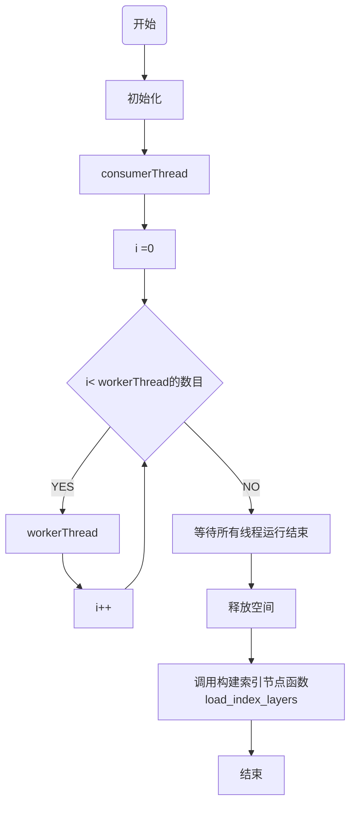
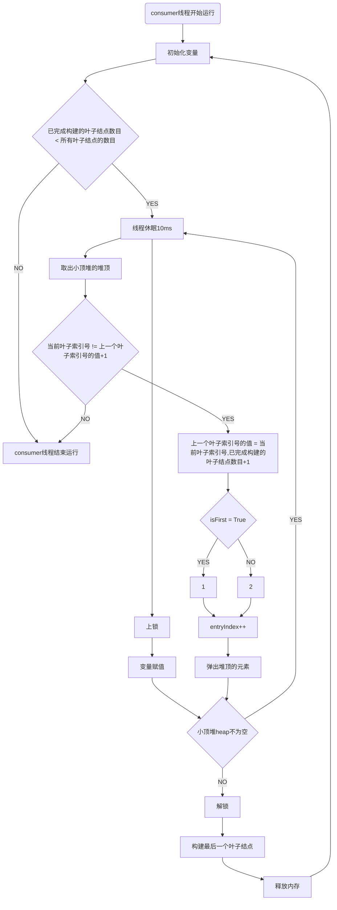
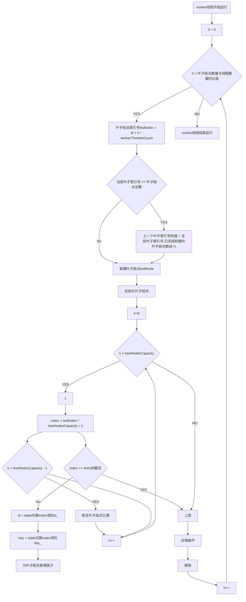
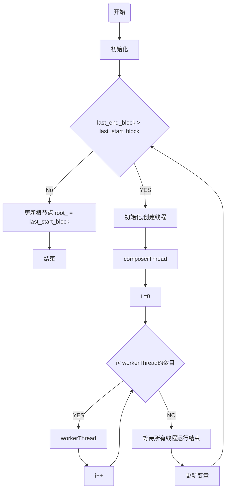
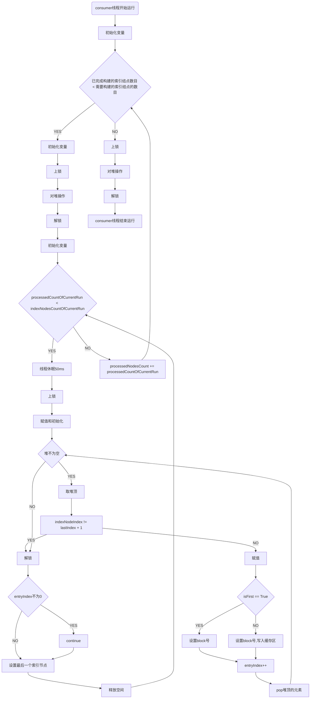
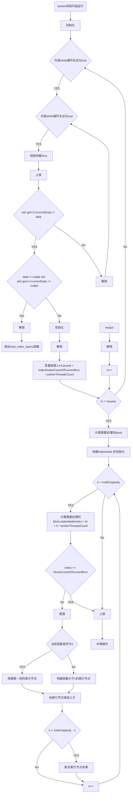

## 数据库课程设计

### 一、Bulkloading 过程

Bulkloading 的目标是对有序的数据批量构建 B+ 树。对于本次课程设计，它分为以下两个步骤：

* 构建叶子节点。本质是一层双向链表，链表的每个节点含有两个数组，一个存储键 `key`，另一个存储值 `id`，后者实质上是磁盘块的索引。一个 `key` 对应 16 个 `id`，这里主要是在节省磁盘空间和访问速度之间的权衡。
* 构建索引节点。本质是若干层的双向链表，每一层的一个节点会指向下一层的多个节点，以此达到 B+ 树的搜索功能。每个节点也有两个数组，一个存储 `key`，另一个存储指向叶子节点的磁盘块的指针，它们在数量上则是一比一的关系。

助教提供的源码采用串行化的加载算法，先构造叶子节点，后构造索引节点。

* 对于叶子节点，按顺序遍历输入的数据，逐个地构建出链表的节点。遍历结束之后构建完成。
* 对于索引节点，首先按顺序遍历叶子节点层里的所有节点，拿到它们的 `key` 和磁盘块指针，以此构建一层链表。之后，又以前面构建的一层链表构建新的一层链表，重复过程直到得到单个节点（也就是根节点）。


### 二、算法并行的设计思路

#### 构建叶子节点

经过分析发现，串行构建代码中存在以下可进行并行优化的点：

1. 可以将待构建的链表节点分为 N 份，由多线程并发地构建每一份，最后连接起来。
2. 对 `block_file.cc` 中 `BlockFile::append_block()` 函数的调用产生了大量的随机 IO，对于机械硬盘而言是非常严重的性能问题。因此，可以先缓存 `b_node.cc` 的 `BLeafNode::init()` 中对前者函数的调用，将多次随机 IO 转换为单次顺序 IO。

结合上述两点，得到这一步的并行设计思路：

设有 $N$ 个待构建的叶子节点，且待构建的叶子节点为 $N_i,i\in[0, 1, ..., N]$。设当前有 $M$ 个 CPU 逻辑核心。我们先不考虑 IO，则节点的构建是 CPU 密集型任务，因此可以使用 $M-1$ 个线程来高效地运行接下来的任务。令 $M_j$ 为第 $j$ 个线程，其中 $j\in [0, 1, ..., M-1]$。

对 $k=j+h(M-1),h\in[0,1,...,\lfloor \frac{N}{M-1} \rfloor-1]$，将 $N_k$ 分配给 $M_j$，这样每个线程都得到了 $\{N_i\}$ 的一部分。让它们各自按下标顺序开始构建叶子节点。我们这时使用另一个线程 $T_c$ 来接收 $M_j$ 输出的叶子节点 $N_i$，将它们按顺序连接（即设置左右指针），缓存一定数量的节点之后一次性地写入磁盘。这里由于我们将原本的多次小规模的随机 IO 转换成了一次大规模的顺序 IO，效率会大大提升。

$M$ 可以通过小顶堆来实现向 $T_c$ 交付有序的叶子节点，同时通过自旋锁来防止竞态条件。$T_c$ 通过从小顶堆获取有序地叶子节点，将若干个数量的节点一次性写入磁盘。

当所有节点都被线程 $T_c$ 落盘之后，它可以得到这一层节点的起始节点的指针以及末尾节点的指针，作为下一层的输入。

#### 构建索引节点

索引节点的构建大致流程和构建叶子节点一样，不过有一点不同：索引节点在构建时需要获得儿子节点的 key，这就需要从磁盘读取信息。从整体来看，构建索引节点的过程会是多次的读—写—读循环，对硬盘的利用并不高效。因此，这里可以进行并行优化的点，除了上面讲到的两点之外，可以再加一点：先让某个线程一次性顺序读取大量的儿子节点到内存中，让索引节点可以直接从内存读取儿子节点的数据。

这一步的并行设计思路几乎和构建叶子节点一样：


### 三、算法流程图

注：需要初始化和赋值的内容太多，流程图里省略，具体见代码。

#### 总算法流程图




#### 构建叶子结点

##### 1. consumerThread线程运行




##### 2. workerThread线程运行 (for循环内的算法流程图)



#### 构建索引结点

##### 1. load_index_layers函数算法总流程



##### 2. composerThread线程运行




##### 3. workerThread线程运行 (for循环内的算法流程图)




### 四、关键代码

#### 1. 并行构建叶子结点

- 由于是并发构建叶子结点，因此`fisrt_node`的位置是位于block块号1的位置，即：

```cpp
int start_block = 1;     // position of first node, always be 1
int end_block = 0;       // position of last node
```


- 首先，创建并发线程，创建的线程数目通过函数`std::thread::hardware_concurrency()	`产生，而这个函数会返回能并发在一个程序中的线程数量。断言认为线程数量大于等于1，并且新开一个线程池`workerThreads`。

```cpp
 const auto workerThreadsCount = std::thread::hardware_concurrency() - 1;
 assert(workerThreadsCount >= 1);
 std::vector<std::thread> workerThreads;
```


- 定义块头部的大小，key值空间的大小，entry的大小，树节点的容量，叶子结点的数量。并计算出在我们的设计思路中每个线程需要处理节点个数的理论平均值。

```cpp
const auto headerSize = SIZECHAR + SIZEINT * 3;
const auto keySize =
      ((int)ceil((float)file_->get_blocklength() / LEAF_NODE_SIZE) * SIZEFLOAT + SIZEINT);
const auto entrySize = SIZEINT;
const auto treeNodesCapacity =
      (file_->get_blocklength() - headerSize - keySize) / entrySize;
const auto leafNodesCount = (int)ceil((double)n / treeNodesCapacity);
const auto bound = leafNodesCount / workerThreadsCount;
```


- 创建一个用于并发控制的锁`lock`，便于互斥操作或访问互斥区。同时，让tree指针指向this指针。

```cpp
auto lock = std::make_unique<SpinLock>();
auto tree = this;
```


- 定义一种元组类型，其内包含两种数据类型，分别为`int`和`BLeafNode*`。创建了以该元组为元素的优先队列，排序方式为自定义的`compare`类型，构建小顶堆。

```cpp
using Tuple = std::tuple<int, BLeafNode *>;
const auto compare = [](const Tuple &a, const Tuple &b) {
    return std::get<0>(a) > std::get<0>(b);
  };
std::priority_queue<Tuple, std::vector<Tuple>, decltype(compare)> heap(
      compare);
```


- 消费者线程的工作：
  - `consumerThread`是用于接收 `workerThread` 输出的叶子节点 $N_i$，将它们按顺序连接（即设置左右指针），缓存一定数量的节点之后一次性地写入磁盘
  - 初始化：`processedNodes`是已经完成的节点，并把最后一个叶子结点`lastLeafIndex`的索引号设为-1，最后一个块`lastLeafIndex`的索引号设置为0。
  - 进入while循环，while循环的退出条件是所有叶子节点构建完成。即当前完成的节点数量大于等于叶子结点数量`processedNodes >= leafNodesCount`.
    - 首先让线程进入休眠，休眠10毫秒，然后进行上锁，并获取堆heap的大小，定义data的大小，并把`isFirst`设置为真，entryIndex的值设置为0.。
    - 当小顶堆不为空时，则`consumerThread`把小顶堆里面的叶子结点提取出来，并把叶子结点连接成双向链表，同时写入缓存区。
  - while循环的过程中，通过自旋锁来防止竞态条件。while循环结束后，就释放自旋锁。
  - 设置最后一个叶子结点的区块号，连接进双向链表，并写入缓存区。
  - 最后将若干个数量的节点一次性写入磁盘，即`lastBlockIndex = tree->file_->write_blocks(data, entryIndex, lastBlockIndex);`。
  - 释放内存空间。

```cpp
  auto consumerThread =
      std::thread([&lock, &heap, tree, &end_block, &leafNodesCount, n] {
        int processedNodes = 0;
        int lastLeafIndex = -1;
        int lastBlockIndex = 0;  
        // 这里的情况和 start_block = 1 的原因一样，
        // file_ 里第一个 block 一定是树根节点

        while (processedNodes < leafNodesCount) {
          std::this_thread::sleep_for(std::chrono::milliseconds(10));

          lock->lock();
          const auto heapSize = heap.size();
          char *data = new char[heapSize * tree->file_->get_blocklength()];
          bool isFirst = true;
          int entryIndex = 0;
          BLeafNode *prev;
          while (!heap.empty()) {
            auto [leafIndex, leafNode] = heap.top();
            if (leafIndex != lastLeafIndex + 1) {
              break;
            }
            lastLeafIndex = leafIndex;
            processedNodes++;

            if (isFirst) {
              isFirst = false;
              if (lastBlockIndex > 0) {
                leafNode->set_left_sibling(lastBlockIndex);
              }
              leafNode->set_block(lastBlockIndex + entryIndex + 1);
              prev = leafNode;
            } else {
              leafNode->set_block(lastBlockIndex + entryIndex + 1);
              leafNode->set_left_sibling(prev->get_block());
              prev->set_right_sibling(leafNode->get_block());
              prev->write_to_buffer(data + (entryIndex - 1) *
                                               tree->file_->get_blocklength());
              delete prev;
              prev = leafNode;
            }

            entryIndex++;
            heap.pop();
          }
          lock->unlock();

          if (!entryIndex) {
            continue;
          }

          prev->set_block(lastBlockIndex + entryIndex);
          end_block = prev->get_block();
          if (end_block > n) {
            throw;
          }
          if (processedNodes < leafNodesCount) {
            prev->set_right_sibling(lastBlockIndex + entryIndex + 1);
          }
          prev->write_to_buffer(data + (entryIndex - 1) *
                                           tree->file_->get_blocklength());
          delete prev;
          prev = nullptr;

          // 这里写入的大小不是 heapSize 而是 entryIndex
          lastBlockIndex =
              tree->file_->write_blocks(data, entryIndex, lastBlockIndex);
          delete[] data;
          data = nullptr;
        }
      });
```


Worker线程的工作：

- 每个`workerThread`按照其下标顺序构建叶子节点。其中`emplace_back`的构造方式是就地构造，不用构造后再次复制到容器中。
- 进入外层for循环
  - 首先计算出`workerThread`所需要处理的叶节点起始 ID。
  - 新构建一个叶子结点` leafNode = new BLeafNode()`，完成初始化后，叶子结点中添加`data.csv`中的数据（存于table中），即当该叶子结点未满（没超过叶子结点的容量时），往其中加入键值对（key和id）。叶子结点容量满时即退出内层for循环。
  - 由于所有叶子结点都要通过小顶堆传送给`consumerThread`，`consumerThread`中需要取出小顶堆中的叶子结点，因此对小顶堆的操作是互斥操作。因此给其上锁。
- 退出for循环时，所有叶子结点构建完成。

```cpp
	for (int i = 0; i < workerThreadsCount; i++) {
    workerThreads.emplace_back(std::thread(
        [=, &lock, &heap](int id) {
          for (int h = 0; h <= bound; h++) {
            auto leafIndex = id + h * workerThreadsCount;
            if (leafIndex >= leafNodesCount) {
              continue;
            }
            auto leafNode = new BLeafNode();
            leafNode->init(0, tree);
            for (int k = 0; k < treeNodesCapacity; k++) {
              auto index = leafIndex * treeNodesCapacity + k;
              if (index >= n) {
                break;
              }
              auto id = table[index].id_;
              auto key = table[index].key_;
              leafNode->add_new_child(id, key);
              if (k < treeNodesCapacity - 1) {
                assert(!leafNode->isFull());
              }
            }
            lock->lock();
            heap.emplace(std::make_tuple(leafIndex, leafNode));
            lock->unlock();
          }
        },
        i));
  }
```


- 等待所有的线程运行完成，释放内存空间，进入索引节点的构建流程。

```cpp
consumerThread.join();
for (auto &thread : workerThreads) {
	thread.join();
}
workerThreads.clear();
load_index_layers(start_block, end_block);
```


#### 2. 并行构建索引结点

- 初始化，因为是索引节点，因此此时的层数是从1开始，即令`current_level`为1。

```cpp
int current_level = 1;               // current level (leaf level is 0)
int last_start_block = start_block;  // build b-tree level by level
int last_end_block = end_block;      // build b-tree level by level
```


- 同叶子结点。

```cpp
const auto workerThreadsCount = std::thread::hardware_concurrency() - 1;
// const auto workerThreadsCount = 1;
assert(workerThreadsCount >= 1);
const auto headerSize = SIZECHAR + SIZEINT * 3;
const auto entrySize = SIZEFLOAT + SIZEINT;
// 一个 index node 的容量
const auto nodeCapacity = (file_->get_blocklength() - headerSize) / entrySize;
```


- 进入while循环，while循环内进行索引节点的分层构建，其中while循环的结束条件为：最后一个结束的块与最后一个开始块的块号相同。

  - 在while循环内，首先计算出需要扫描的 block 总数和需要构建的 index node 总数。

    ```cpp
    // 这一层需要扫描的 block 总数
    const auto totalBlocksCount = last_end_block - last_start_block + 1;
    // 这一层要构建的 index node 总数
    const auto todoNodesCount =
            (int)ceil((double)totalBlocksCount / nodeCapacity)
    ```

  - 创建锁、元组tuple、线程等，同叶子结点。

    ```cpp
    auto lock = std::make_unique<SpinLock>();
        auto tree = this;
        auto currentData = std::make_tuple<int, char *>(-1, nullptr);
    
        using Tuple = std::tuple<int, BIndexNode *>;
        const auto compare = [](const Tuple &a, const Tuple &b) {
          return std::get<0>(a) > std::get<0>(b);
        };
        std::priority_queue<Tuple, std::vector<Tuple>, decltype(compare)> heap(
            compare);
    
        std::vector<std::thread> workerThreads;
    ```

  - `composerThread`线程进行工作（详细见下）。

  - `workerThread`线程进行工作（详细见下）。

  - 等待所有的线程运行完成，释放内存空间，更新信息，更新当前层数。

    ```cpp
        composerThread.join();
        for (auto &thread : workerThreads) {
          thread.join();
        }
    
        workerThreads.clear();
    
        last_start_block = start_block;  // update info
        last_end_block = end_block;      // build b-tree of higher level
        ++current_level;
    ```

- 更新根节点。

```cpp
  root_ = last_start_block;  // update the <root>
```


消费者线程`composerThread`

- `composerThread`是用于接收 `workerThread` 输出的索引节点 $N_i$，将它们按顺序连接（即设置左右指针），缓存一定数量的节点之后一次性地写入磁盘。

- 初始化：已加载的block的数量设为0，以构建好的节点数量设为0，最后一个索引号为-1，令最后一个block的块号为end_block的块号（从并行构建叶子结点的函数传入并行构建索引节点函数）。

- 进入while循环，while循环的退出条件是索引节点构建完成。即当前完成的节点数量大于等于需要完成的索引结点数量`processedNodes >= todoNodesCount`.

  - 首先让线程进入休眠，休眠50毫秒，然后进行上锁，并获取堆heap的大小，定义data的大小，并把`isFirst`设置为真，entryIndex的值设置为0。
  - 当小顶堆不为空时，则`consumerThread`把小顶堆里面的索引结点提取出来，并把索引结点连接成双向链表，同时写入缓存区。

  - while循环的过程中，通过自旋锁来防止竞态条件。while循环结束后，就释放自旋锁。
  - 设置最后一个叶子结点的区块号，连接进双向链表，并写入缓存区。
  - 最后将若干个数量的节点一次性写入磁盘，即`lastBlockIndex = tree->file_->write_blocks(data, entryIndex, lastBlockIndex);`。
  - 释放内存空间，重新计算已完成的索引节点数目。

- 在这个工程中，对小顶堆的操作需上锁，使用完需释放锁。

```cpp
    auto composerThread = std::thread([=, &lock, &heap, &todoNodesCount,
                                       &start_block, &end_block, &currentData] {
      int loadedBlocksCount = 0;
      int processedNodesCount = 0;
      int lastIndex = -1;
      int lastBlockIndex = last_end_block;

      while (processedNodesCount < todoNodesCount) {
        const auto loadedCount =
            std::min(nodeCapacity * 10000, totalBlocksCount - loadedBlocksCount);
        loadedBlocksCount += loadedCount;
        char *data = new char[tree->file_->get_blocklength() * loadedCount];
        assert(tree->file_->read_blocks(data,
                                        last_start_block + processedNodesCount,
                                        loadedCount) == true);
        lock->lock();
        currentData = {loadedCount, data};
        lock->unlock();

        auto processedCountOfCurrentRun = 0;
        const auto indexNodesCountOfCurrentRun =
            (int)ceil((double)loadedCount / nodeCapacity);
        while (processedCountOfCurrentRun < indexNodesCountOfCurrentRun) {
          std::this_thread::sleep_for(std::chrono::milliseconds(50));

          lock->lock();
          const auto heapSize = heap.size();
          char *data = new char[heapSize * tree->file_->get_blocklength()];
          bool isFirst = true;
          int entryIndex = 0;
          BIndexNode *prev;
          while (!heap.empty()) {
            auto [indexNodeIndex, indexNode] = heap.top();
            if (indexNodeIndex != lastIndex + 1) {
              break;
            }
            lastIndex = indexNodeIndex;
            processedCountOfCurrentRun++;

            if (isFirst) {
              isFirst = false;
              indexNode->set_block(lastBlockIndex + entryIndex + 1);
              if (lastBlockIndex > last_end_block) {
                indexNode->set_left_sibling(
                    lastBlockIndex);  // 不是第一个 block，直接和上一个
                                      // block 相连
              } else {
                start_block =
                    indexNode->get_block();  // 这是这个索引层的第一个 block
              }
              prev = indexNode;
            } else {
              indexNode->set_block(lastBlockIndex + entryIndex + 1);
              indexNode->set_left_sibling(prev->get_block());
              prev->set_right_sibling(indexNode->get_block());
              prev->write_to_buffer(data + (entryIndex - 1) *
                                               tree->file_->get_blocklength());
              delete prev;
              prev = indexNode;
            }

            entryIndex++;
            heap.pop();
          }
          lock->unlock();

          if (!entryIndex) {
            continue;
          }

          prev->set_block(lastBlockIndex + entryIndex);
          end_block = prev->get_block();  // 更新 end_block 指针
          if (processedNodesCount + processedCountOfCurrentRun <
              todoNodesCount) {
            prev->set_right_sibling(lastBlockIndex + entryIndex + 1);
          }
          prev->write_to_buffer(data + (entryIndex - 1) *
                                           tree->file_->get_blocklength());
          delete prev;
          prev = nullptr;

          // 这里写入的大小不是 heapSize 而是 entryIndex
          lastBlockIndex =
              tree->file_->write_blocks(data, entryIndex, lastBlockIndex);
          delete[] data;
          data = nullptr;
        }

        // 这一轮读取结束
        processedNodesCount += processedCountOfCurrentRun;
      }

      lock->lock();
      currentData = std::make_tuple<int, char *>(-1, nullptr);
      lock->unlock();
    });
```


Worker线程的工作：

- 每个`workerThread`按照其下标顺序构建索引节点。其中`emplace_back`的构造方式是就地构造，不用构造后再次复制到容器中。

- 初始化，对`blocksCountOfCurrentRun`和`data`进行初始化。

- 进入while外层循环。只能通过break退出循环

  - 进入while内层循环

    - 首先让workerThread休眠5毫秒。
    - 上锁，因为要对堆`currentData`进行操作，读出堆中的内容。
    - 释放锁。

  - 计算当前轮次的索引节点的数量，以及当前轮次索引节点的数量与`workThreads`的数量，存于`bound`中。

  - 进入for循环。

    - for循环内，首先计算出`workerThread`自身需要处理的`block`的部分，并据此构建出索引结点。
    - 新构建一个索引结点` indexNode = new BIndexNode()`，初始化，但是先不写入磁盘中。原因：索引节点在构建时需要获得儿子节点的 key，这就需要从磁盘读取信息。从整体来看，构建索引节点的过程会是多次的读—写—读循环，对硬盘的利用并不高效，因此我们修改了`b_node.h `和 `b_node.c`文件（对`BIndexNode`的类进行了修改）。如下所示，新增了函数。

    ```cpp
    	virtual void init_no_write(
    		int   level,
    		BTree *btree);
    
    	virtual void init_restore_in_place(
    		BTree *btree,
    		int block,
    		Block data);
    
    	void add_new_child_no_dirty(
    		float key,
    		int son);
    ```

    ```cpp
    void BIndexNode::init_no_write(int level, BTree *btree) {
      btree_ = btree;
      level_ = (char)level;
      num_entries_ = 0;
      left_sibling_ = -1;
      right_sibling_ = -1;
      dirty_ = false;
    
      // page size B
      int b_length = btree_->file_->get_blocklength();
      capacity_ = (b_length - get_header_size()) / get_entry_size();
      if (capacity_ < 50) {  // ensure at least 50 entries
        printf("capacity = %d, which is too small.\n", capacity_);
        exit(1);
      }
    
      key_ = new float[capacity_];
      son_ = new int[capacity_];
      //分配内存
      memset(key_, MINREAL, capacity_ * SIZEFLOAT);
      memset(son_, -1, capacity_ * SIZEINT);
    }
    ```

    - 计算block号，其中block号为`start_block`的值与`index`的值的和。
    - 根据当前层数不同（因为如果层数为1，需要连接叶子结点；其余层数不需要），调用自己编写的`init_restore_in_place`函数，一次性顺序读取大量的儿子节点到内存中。

    ```cpp
    void BIndexNode::init_restore_in_place(BTree *btree, int block, Block data) {
      btree_ = btree;
      block_ = block;
      dirty_ = false;
    
      int b_len = btree_->file_->get_blocklength();
      capacity_ = (b_len - get_header_size()) / get_entry_size();
      if (capacity_ < 50) {
        printf("capacity = %d, which is too small.\n", capacity_);
        exit(1);
      }
    
      key_ = new float[capacity_];
      son_ = new int[capacity_];
      memset(key_, MINREAL, capacity_ * SIZEFLOAT);
      memset(son_, -1, capacity_ * SIZEINT);
    
      read_from_buffer(data);
    }
    ```

    - 往当前索引节点增加儿子节点，使用自己编写的函数`add_new_child_no_dirty`。

  ```cpp
  void BIndexNode::add_new_child_no_dirty(
  	float key,
  	int   son)
  {
  	key_[num_entries_] = key;
  	son_[num_entries_] = son;
  	++num_entries_;
  }
  ```

  - 退出内层for循环。由于所有素音结点都要通过小顶堆传送给`composerThread`，`composerThread`中需要取出小顶堆中的索引结点，因此对小顶堆的操作是互斥操作。因此给其上锁。

- 退出for循环时，所有索引结点构建完成。

```cpp
    for (int i = 0; i < workerThreadsCount; i++) {
      workerThreads.emplace_back(std::thread(
          [=, &currentData, &lock, &heap, &current_level, &end_block](int id) {
            int blocksCountOfCurrentRun = -1;
            char *data = nullptr;
            while (true) {
              while (true) {
                std::this_thread::sleep_for(std::chrono::milliseconds(5));
                lock->lock();
                if (std::get<1>(currentData) != data) {
                  if (data != nullptr && std::get<1>(currentData) == nullptr) {
                    lock->unlock();
                    return;
                  }
                  blocksCountOfCurrentRun = std::get<0>(currentData);
                  data = std::get<1>(currentData);
                  lock->unlock();
                  break;
                }
                lock->unlock();
              }

              const auto indexNodesCountOfCurrentRun =
                  (int)ceil((double)blocksCountOfCurrentRun / nodeCapacity);
              const auto bound =
                  indexNodesCountOfCurrentRun / workerThreadsCount;
              for (int h = 0; h <= bound; h++) {
                // 这个 index 是 composerThread 给的这一波 totalCount 个 block
                // 数据里的相对顺序 接下来这个 workerThread
                // 会算出自己应该处理哪一部分的block，构建出对应的 index node
                auto indexNodeIndex = id + h * workerThreadsCount;
                if (indexNodeIndex >= indexNodesCountOfCurrentRun) {
                  continue;
                }
                auto indexNode = new BIndexNode();
                indexNode->init_no_write(current_level, tree);
                for (int k = 0; k < nodeCapacity; k++) {
                  auto index = indexNodeIndex * nodeCapacity + k;
                  if (index >= blocksCountOfCurrentRun) {
                    break;
                  }
                  float key;
                  auto block =
                      start_block + index;  // 此时就已经可以知道 block 号了
                  if (current_level == 1) {
                    BLeafNode node;
                    node.init_restore_in_place(
                        tree, block,
                        data + tree->file_->get_blocklength() * index);
                    key = node.get_key_of_node();
                  } else {
                    BIndexNode node;
                    node.init_restore_in_place(
                        tree, block,
                        data + tree->file_->get_blocklength() * index);
                    key = node.get_key_of_node();
                  }
                  indexNode->add_new_child_no_dirty(key, block);
                  if (k < nodeCapacity - 1) {
                    assert(!indexNode->isFull());
                  }
                }
                lock->lock();
                heap.emplace(std::make_tuple(indexNodeIndex, indexNode));
                lock->unlock();
              }
            }
          },
          i));
    }
```


### 五、实验结果

#### 1.并行构建叶子节点

在完成第一步之后，即并行构建叶子节点，但仍然串行构建索引节点，多次对 `data/dataset.csv` 运行原本的程序以及修改后的程序：

```
$ ./make_hex.sh
data_file   = ./data/dataset.csv
tree_file   = ./result/B_tree
运行时间: 0.085063  s
data_file   = ./data/dataset.csv
tree_file   = ./result/B_tree
运行时间: 0.146649  s
$ ./make_hex.sh
data_file   = ./data/dataset.csv
tree_file   = ./result/B_tree
运行时间: 0.078678  s
data_file   = ./data/dataset.csv
tree_file   = ./result/B_tree
运行时间: 0.132158  s
$ ./make_hex.sh
data_file   = ./data/dataset.csv
tree_file   = ./result/B_tree
运行时间: 0.059390  s
data_file   = ./data/dataset.csv
tree_file   = ./result/B_tree
运行时间: 0.144739  s
$ ./make_hex.sh
data_file   = ./data/dataset.csv
tree_file   = ./result/B_tree
运行时间: 0.068712  s
data_file   = ./data/dataset.csv
tree_file   = ./result/B_tree
运行时间: 0.161334  s
```

可以看到，此时程序的加速比在 2～3 之间。

#### 2. 并行构建索引节点

在将索引节点也进行并行化之后，多次对 `data/dataset.csv` 运行原本的程序以及修改后的程序：


### 六、实验分析

```
< 004512b0: 0000 0000 0000 0000 0000 0000 0000 0000  ................
< 004512c0: 0000 0000 0000 0000 0000 0000 0000 0000  ................
< 004512d0: 0000 0000 0000 0000 0000 0000 0000 0000  ................
< 004512e0: 0000 0000 0000 0000 0000 0000 0000 0000  ................
< 004512f0: 0000 0000 0000 0000 0000 0000 0000 0000  ................
< 00451300: 0000 0000 0000 0000 0000 0000 0000 0000  ................
< 00451310: 0000 0000 0000 0000 0000 0000 0000 0000  ................
< 00451320: 0000 0000 0000 0000 0000 0000 0000 0000  ................
---
> 004512b0: 8070 0000 0000 0000 6400 0000 0000 0000  .p......d.......
> 004512c0: 223b d79e ea7f 0000 0000 0000 7300 0000  ";..........s...
> 004512d0: 5410 0000 5610 0000 0000 0000 0000 0000  T...V...........
> 004512e0: 0100 0000 5510 0000 7300 0000 0000 0000  ....U...s.......
> 004512f0: 0000 0000 0000 0000 0800 0000 0000 0000  ................
> 00451300: 0000 0000 0000 0000 0800 0000 0000 0000  ................
> 00451310: 0000 0000 0000 0000 b110 0000 0000 0000  ................
> 00451320: 4013 0060 ed7f 0000 8000 0060 ed7f 0000  @..`.......`....
282933,282934c282933,282934
< 00451340: 0000 0000 0000 0000 0000 0000 0000 0000  ................
< 00451350: 0000 0000 0000 0000 0000 0000 0000 0000  ................
---
> 00451340: 0000 0000 0000 0000 e101 0000 0000 0000  ................
> 00451350: a013 0060 ed7f 0000 1043 0160 ed7f 0000  ...`.....C.`....
282947,282954c282947,282954
< 00451420: 0088 2200 0000 0000 0078 2200 0000 0000  .."......x".....
< 00451430: 0079 2200 0000 0000 007a 2200 0000 0000  .y"......z".....
< 00451440: 007b 2200 0000 0000 007c 2200 0000 0000  .{"......|".....
< 00451450: 007d 2200 0000 0000 007e 2200 0000 0000  .}"......~".....
< 00451460: 007f 2200 0000 0000 0080 2200 0000 0000  ..".......".....
< 00451470: 0081 2200 0000 0000 0082 2200 0000 0000  ..".......".....
< 00451480: 0083 2200 0000 0000 0084 2200 0000 0000  ..".......".....
< 00451490: 0085 2200 0000 0000 0000 0000 0000 0000  ..".............
---
> 00451420: 0088 2200 0000 0000 0000 0000 0000 0000  ..".............
> 00451430: 0000 0000 0000 0000 0000 0000 0000 0000  ................
> 00451440: 0000 0000 0000 0000 0000 0000 0000 0000  ................
> 00451450: 0000 0000 0000 0000 0000 0000 0000 0000  ................
> 00451460: 0000 0000 0000 0000 0000 0000 0000 0000  ................
> 00451470: 0000 0000 0000 0000 0000 0000 0000 0000  ................
> 00451480: 0000 0000 0000 0000 0000 0000 0000 0000  ................
> 00451490: 0000 0000 0000 0000 0000 0000 0000 0000  ................
282964,282971c282964,282971
< 00451530: 0000 0000 0000 0000 0000 0000 0000 0000  ................
< 00451540: 0000 0000 0000 0000 0000 0000 0000 0000  ................
< 00451550: 0000 0000 0000 0000 0000 0000 0000 0000  ................
< 00451560: 0000 0000 0000 0000 0000 0000 0000 0000  ................
< 00451570: 0000 0000 0000 0000 0000 0000 0000 0000  ................
< 00451580: 0000 0000 0000 0000 0000 0000 0000 0000  ................
< 00451590: 0000 0000 0000 0000 0000 0000 0000 0000  ................
< 004515a0: 0000 0000 0000 0000 0000 0000 0000 0000  ................
---
> 00451530: e001 0000 0000 0000 6400 0000 0000 0000  ........d.......
> 00451540: f119 d5ae ea7f 0000 0000 0000 7300 0000  ............s...
> 00451550: 3b1c 0000 3d1c 0000 0000 0000 0000 0000  ;...=...........
> 00451560: 0100 0000 3c1c 0000 7300 0000 0000 0000  ....<...s.......
> 00451570: 0000 0000 0000 0000 0800 0000 0000 0000  ................
> 00451580: 0000 0000 0000 0000 0800 0000 0000 0000  ................
> 00451590: 0000 0000 0000 0000 f106 0000 0000 0000  ................
> 004515a0: 702d 0650 ed7f 0000 8000 0050 ed7f 0000  p-.P.......P....
282973,282974c282973,282974
< 004515c0: 0000 0000 0000 0000 0000 0000 0000 0000  ................
< 004515d0: 0000 0000 0000 0000 0000 0000 0000 0000  ................
---
> 004515c0: 0000 0000 0000 0000 e101 0000 0000 0000  ................
> 004515d0: f076 0350 ed7f 0000 801a 0050 ed7f 0000  .v.P.......P....
```

对比串行和并行代码得到的 B 树二进制文件，`diff` 程序仅输出了上面的不同。可以看到，这几行都是位于文件的末尾，且根据 `b_node.cc` 中相关数据结构的定义，我们发现它们都没有代表实际数据（也就是 block 中的闲置位），两个代码中的这些位在使用 `new char[]` 也即 `malloc()` 之后并没有进行清零，所以导致了输出的不一致。排除掉此因素之后，我们认为二者输出的文件是一致的。


### 七、性能调优、创新优化

在设计思路中提到，每当一个叶子节点使用 `BLeafNode::init()` 进行初始化操作时，都会调用到 `BlockFile::append_block()` 方法。而从它的函数体中也可以看见每调用一次 `BlockFile::append_block()` 方法就需要进行两次 `fseek()` 以及一次 `fwrite_number()` 的操作，这些操作将会在 B+ 树的构建过程中产生大量的随机 IO。

```cpp
/* 
	block_file.cc 
*/
int BlockFile::append_block(		// append new block at the end of file
	Block block)						// the new block
{
	fseek(fp_, 0, SEEK_END);		// <fp_> point to the end of file
	put_bytes(block, block_length_);// write a <block>
	++num_blocks_;					// add 1 to <num_blocks_>
	
	fseek(fp_, SIZEINT, SEEK_SET);	// <fp_> point to pos of header
	fwrite_number(num_blocks_);		// update <num_blocks_>

	// -------------------------------------------------------------------------
	//  <fp_> point to the pos of new added block. 
	//  the equation <act_block_> = <num_blocks_> indicates the file pointer 
	//  point to new added block.
	//  return index of new added block
	// -------------------------------------------------------------------------
	fseek(fp_, -block_length_, SEEK_END);
	return (act_block_ = num_blocks_) - 1;
}
```

对于固态硬盘来说，随机 IO 所带来的影响并不会特别的明显，但对于机械硬盘来说，大量的随机 IO 也就意味着大量的时间将会被浪费用于定位目标页所在的位置，从而造成严重的性能损失。像数据库这种需要大容量数据存储的服务，相对便宜的机械硬盘才是主力存储设备。考虑机械硬盘顺序 IO 比随机 IO 速度快的特性，我们决定将上述的操作进行修改与优化。

首先修改 `BLeafNode::init()` 函数。直接将末尾处的 `BlockFile::append_block()`，即意味着当进行叶子节点的初始化操作时，将不再立即把当前叶子节点写入到硬盘中。在叶子节点的构建过程中，我们令 `consumerThread` 不停获取初始化完成的叶子节点，当叶子节点的数量占满一个块的时候才进行写出的操作。经过以上操作，即可成功地将大量的随机 IO 操作变为一次顺序 IO 操作。

```cpp
/* 
	b_node.cc 
	改写 BLeafNode::init() 方法，使得初始化叶子节点不会进行写出操作
*/
void BLeafNode::init(				// init a new node, which not exist
	int   level,						// level (depth) in b-tree
	BTree *btree)						// b-tree of this node
{
	btree_         = btree;
	level_         = (char) level;

	num_entries_   = 0;
	num_keys_      = 0;
	left_sibling_  = -1;
	right_sibling_ = -1;
	dirty_         = true;

	// -------------------------------------------------------------------------
	//  init <capacity_keys_> and calc key size
	// -------------------------------------------------------------------------
	//page size B
	int b_length = btree_->file_->get_blocklength();
	int key_size = get_key_size(b_length);

	key_ = new float[capacity_keys_];
	memset(key_, MINREAL, capacity_keys_ * SIZEFLOAT);
	
	int header_size = get_header_size();
	int entry_size = get_entry_size();

	capacity_ = (b_length - header_size - key_size) / entry_size;
	if (capacity_ < 100) {			// at least 100 entries
		printf("capacity = %d, which is too small.\n", capacity_);
		exit(1);
	}
	id_ = new int[capacity_];
	memset(id_, -1, capacity_ * SIZEINT);
}
```

```cpp
/*
	b_tree.cc
	bulk_load() 中消费者线程进行写出操作
*/

lastBlockIndex =
  tree->file_->write_blocks(data, entryIndex, lastBlockIndex);
delete[] data;
data = nullptr;
```

同理，由于构建索引节点的思路和构建叶子节点相似。从代码中可知索引节点在进行初始化的时候同样会进行写出操作，这里同样为 `BIndexNode` 添加 `init_no_write())` 方法使得初始化的时候不进行写出操作。

```cpp
/*
	b_node.cc
	为 BIndexNode 添加不进行写出操作的初始化方法
*/
void BIndexNode::init_no_write(int level, BTree *btree) {
  btree_ = btree;
  level_ = (char)level;
  num_entries_ = 0;
  left_sibling_ = -1;
  right_sibling_ = -1;
  dirty_ = false;

  // page size B
  int b_length = btree_->file_->get_blocklength();
  capacity_ = (b_length - get_header_size()) / get_entry_size();
  if (capacity_ < 50) {  // ensure at least 50 entries
    printf("capacity = %d, which is too small.\n", capacity_);
    exit(1);
  }

  key_ = new float[capacity_];
  son_ = new int[capacity_];
  //分配内存
  memset(key_, MINREAL, capacity_ * SIZEFLOAT);
  memset(son_, -1, capacity_ * SIZEINT);
}
```

在进行索引节点的构建过程中，我们需要使用到当前层数所对应的前一层节点，于是会使用到`init_restore()` 方法将前一层节点从硬盘中读取到内存进行构建的操作。从代码中不难发现 `BIndexNode::init_restore` 和 `BLeafNode::init_restore` 也存在着 IO 操作。由于我们的并行实现中将数据写入到了缓冲区中，当需要前一层节点的信息时，可以直接从缓冲区中读取数据。因此为 `BIndexNode` 和 `BLeafNode` 新增 `init_restore_in_place()` 方法，从缓冲区中读取数据，无需再进行 IO 操作。

```cpp
/*
	b_node.cc
	一次读取整个索引节点块
*/
void BIndexNode::init_restore_in_place(BTree *btree, int block, Block data) {
  btree_ = btree;
  block_ = block;
  dirty_ = false;

  int b_len = btree_->file_->get_blocklength();
  capacity_ = (b_len - get_header_size()) / get_entry_size();
  if (capacity_ < 50) {
    printf("capacity = %d, which is too small.\n", capacity_);
    exit(1);
  }

  key_ = new float[capacity_];
  son_ = new int[capacity_];
  memset(key_, MINREAL, capacity_ * SIZEFLOAT);
  memset(son_, -1, capacity_ * SIZEINT);

  read_from_buffer(data);
}

```

```cpp
/* 
	b_node.cc 
	一次读取整个叶子节点块
*/
void BLeafNode::init_restore_in_place(BTree *btree, int block, Block data) {
  btree_ = btree;
  block_ = block;
  dirty_ = false;

  int b_length = btree_->file_->get_blocklength();
  int key_size = get_key_size(b_length);

  key_ = new float[capacity_keys_];
  memset(key_, MINREAL, capacity_keys_ * SIZEFLOAT);

  int header_size = get_header_size();
  int entry_size = get_entry_size();

  capacity_ = (b_length - header_size - key_size) / entry_size;
  if (capacity_ < 100) {
    printf("capacity = %d, which is too small.\n", capacity_);
    exit(1);
  }
  id_ = new int[capacity_];
  memset(id_, -1, capacity_ * SIZEINT);

  read_from_buffer(data);
}
```

