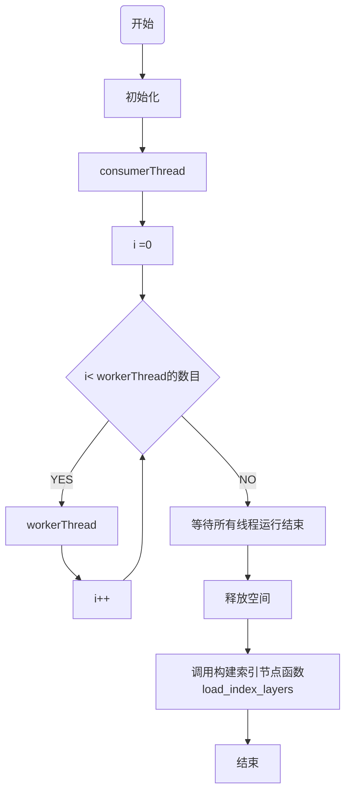
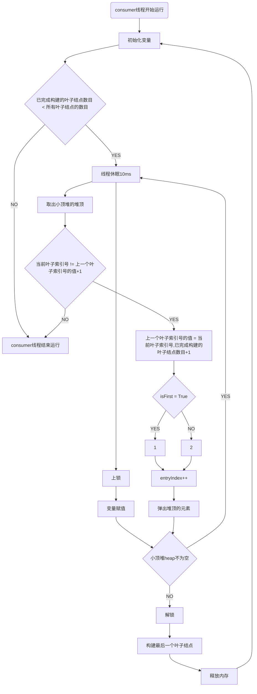
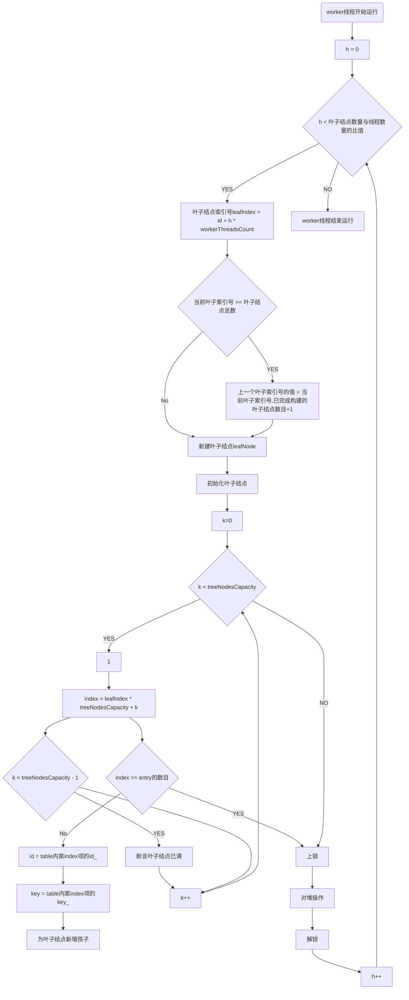
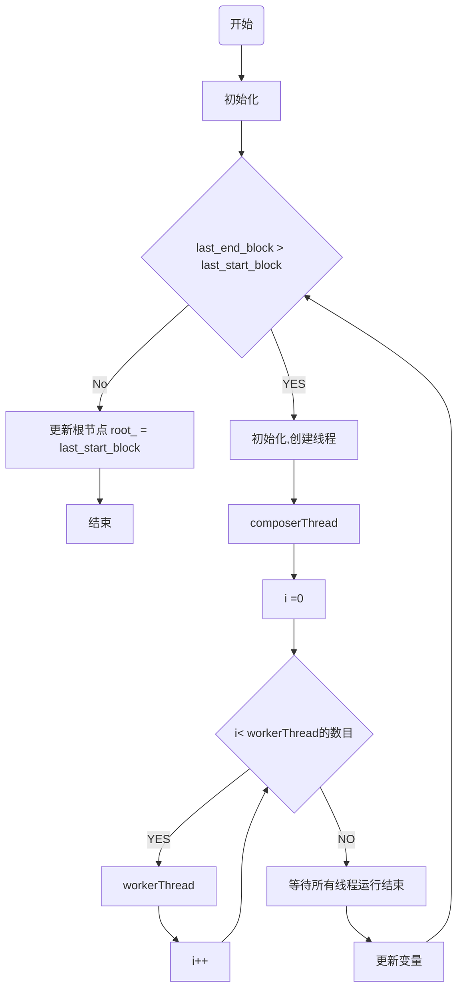
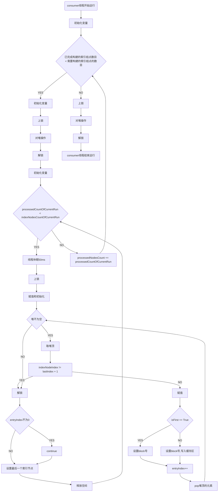
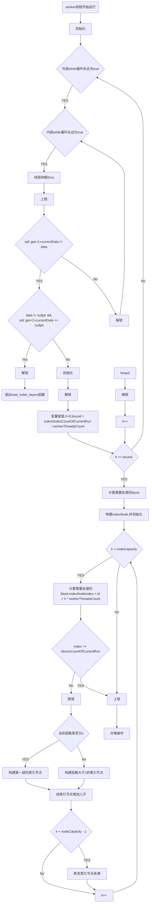

# 算法流程图

注：需要初始化和赋值的内容太多，流程图里省略，具体见代码。

### 总算法流程图

#### 一、构建叶子结点

##### 1. consumerThread线程运行

##### 2. workerThread线程运行 (for循环内的算法流程图)

#### 二、构建索引结点

##### 1. load_index_layers函数算法总流程

##### 2. composerThread线程运行

##### 3. workerThread线程运行 (for循环内的算法流程图)

